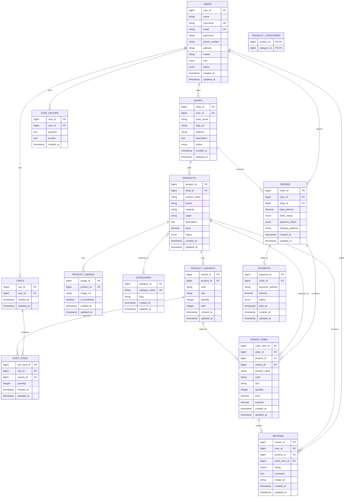

# Thiet ke co so du lieu moi de xuat

Ban thiet ke nay duoc de xuat lai theo huong chuan hoa hon, de tranh luu du lieu lap trong JSON va de dat gan 3NF hon so voi thiet ke cu.

## 1. So do dang de trinh bay

```text
USERS
-------------------------
user_id (PK)
name
username
email
password
phone_number
address
avatar
role
status
created_at
updated_at

|
| 1
|
| n

SHOPS
-------------------------
shop_id (PK)
user_id (FK)
shop_name
logo_url
address
description
status
created_at
updated_at
```

```text
SHOPS
-------------------------
shop_id (PK)

|
| 1
|
| n

PRODUCTS
-------------------------
product_id (PK)
shop_id (FK)
product_name
brand
material
origin
description
price
status
created_at
updated_at
```

```text
PRODUCTS
-------------------------
product_id (PK)

|
| 1
|
| n

PRODUCT_VARIANTS
-------------------------
variant_id (PK)
product_id (FK)
color
size
quantity
sold
created_at
updated_at
```

```text
PRODUCTS
-------------------------
product_id (PK)

|
| 1
|
| n

PRODUCT_IMAGES
-------------------------
image_id (PK)
product_id (FK)
image_url
is_thumbnail
created_at
updated_at
```

```text
CATEGORIES
-------------------------
category_id (PK)
category_name
slug
created_at
updated_at

|
| n
|
| n

PRODUCTS
-------------------------
product_id (PK)


Bang trung gian:

PRODUCT_CATEGORIES
-------------------------
product_id (PK, FK)
category_id (PK, FK)
```

```text
USERS
-------------------------
user_id (PK)

|
| 1
|
| 1

CARTS
-------------------------
cart_id (PK)
user_id (FK)
created_at
updated_at

|
| 1
|
| n

CART_ITEMS
-------------------------
cart_item_id (PK)
cart_id (FK)
variant_id (FK)
quantity
created_at
updated_at
```

```text
USERS
-------------------------
user_id (PK)

|
| 1
|
| n

ORDERS
-------------------------
order_id (PK)
user_id (FK)
shop_id (FK)
total_amount
order_status
payment_status
shipping_address
created_at
updated_at

|
| 1
|
| n

ORDER_ITEMS
-------------------------
order_item_id (PK)
order_id (FK)
product_id (FK)
variant_id (FK)
product_name
color
size
quantity
price
subtotal
created_at
updated_at
```

```text
PRODUCTS
-------------------------
product_id (PK)

|
| 1
|
| n

REVIEWS
-------------------------
review_id (PK)
user_id (FK)
product_id (FK)
order_item_id (FK)
rating
comment
image_url
created_at
updated_at


USERS
-------------------------
user_id (PK)

|
| 1
|
| n

REVIEWS
```

```text
USERS
-------------------------
user_id (PK)

|
| 1
|
| n

CHAT_HISTORY
-------------------------
chat_id (PK)
user_id (FK)
question
answer
created_at
```

```text
ORDERS
-------------------------
order_id (PK)

|
| 1
|
| 1

PAYMENTS
-------------------------
payment_id (PK)
order_id (FK)
payment_method
amount
status
paid_at
created_at
updated_at
```

## 2. So do ERD Mermaid



## 3. Diem cai tien so voi thiet ke cu

- Tach `orders.order_details` thanh bang `order_items`.
- Tach `products.colors` va `products.size_details` thanh bang `product_variants`.
- Tach gio hang thanh `carts` va `cart_items`, de mot user co mot gio hang va gio hang co nhieu san pham.
- Them `payments` de quan ly thong tin thanh toan rieng voi don hang.
- Them `chat_history` de luu lich su hoi dap cua chatbot tu van san pham.
- Giu `product_name`, `color`, `size`, `price` trong `order_items` de luu snapshot tai thoi diem dat hang.

## 4. Danh gia chuan hoa

Thiet ke moi dat gan 3NF hon vi:

- Moi bang quan ly mot nhom du lieu rieng.
- Khong luu danh sach nhieu gia tri trong mot cot JSON.
- Quan he nhieu-nhieu duoc tach bang trung gian.
- Chi tiet don hang va bien the san pham duoc tach rieng.

Luu y: `order_items.product_name`, `order_items.color`, `order_items.size`, `order_items.price` co the xem la du lieu lap so voi `products` va `product_variants`, nhung duoc giu lai co chu dich de luu lich su tai thoi diem mua hang. Day la phi chuan hoa co kiem soat va phu hop voi he thong ban hang.
