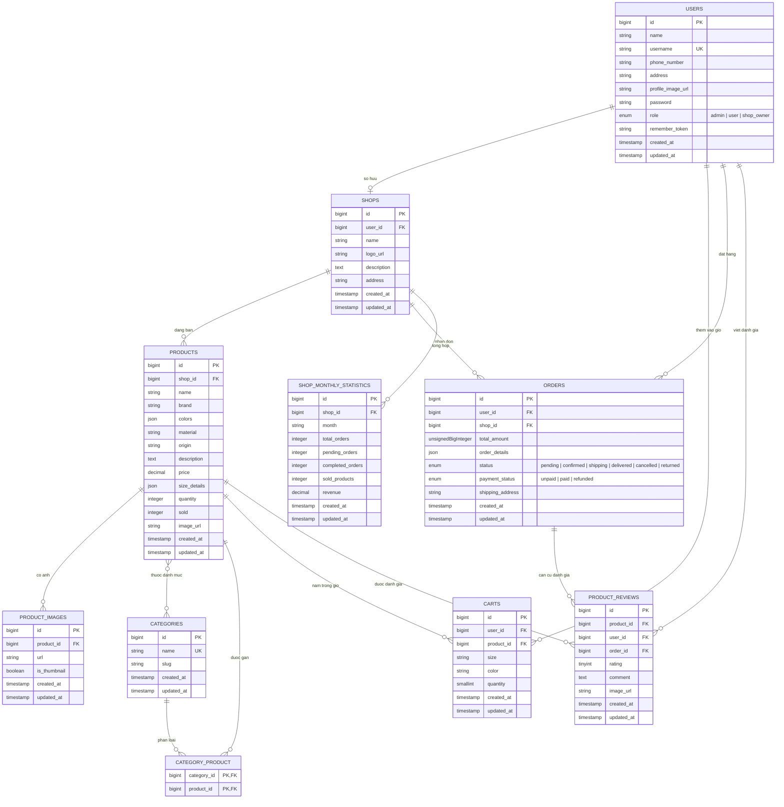

# So do thiet ke co so du lieu

Tai lieu nay duoc tong hop tu migration va Eloquent model trong project Laravel `web-server`.

## So do ERD

## Ghi chu thiet ke

- `users.role` phan quyen tai khoan gom `admin`, `user`, `shop_owner`.
- Moi `shop` thuoc ve mot `user` thong qua `shops.user_id`.
- Moi `product` thuoc ve mot `shop`; anh san pham tach rieng trong `product_images`.
- Quan he san pham - danh muc la nhieu-nhieu qua bang trung gian `category_product`.
- Gio hang luu tung bien the san pham theo `user_id`, `product_id`, `size`, `color`; bo cot nay duoc rang buoc unique.
- Don hang luu chi tiet san pham trong cot JSON `orders.order_details`, thay vi tach bang `order_items`.
- Danh gia san pham lien ket dong thoi voi `product`, `user` va `order`.
- `shop_monthly_statistics` luu so lieu thong ke theo cap `shop_id` va `month`; cap nay duoc rang buoc unique.

## Cac rang buoc va chi muc quan trong

- `users.username` la unique.
- `categories.name` la unique.
- `category_product` dung khoa chinh ghep: `category_id`, `product_id`.
- `carts` unique theo: `user_id`, `product_id`, `size`, `color`.
- `shop_monthly_statistics` unique theo: `shop_id`, `month`.
- `orders` co index thong ke theo `shop_id + created_at` va `shop_id + status + payment_status`.
